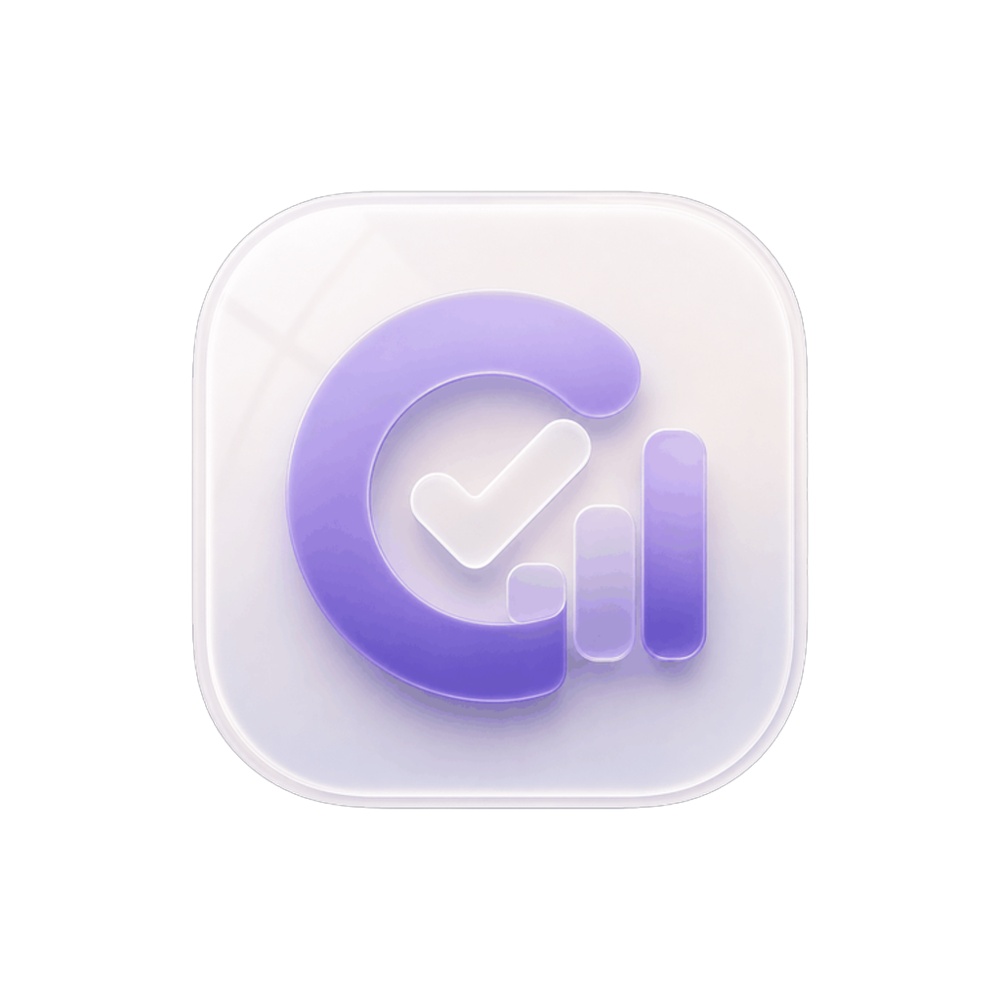
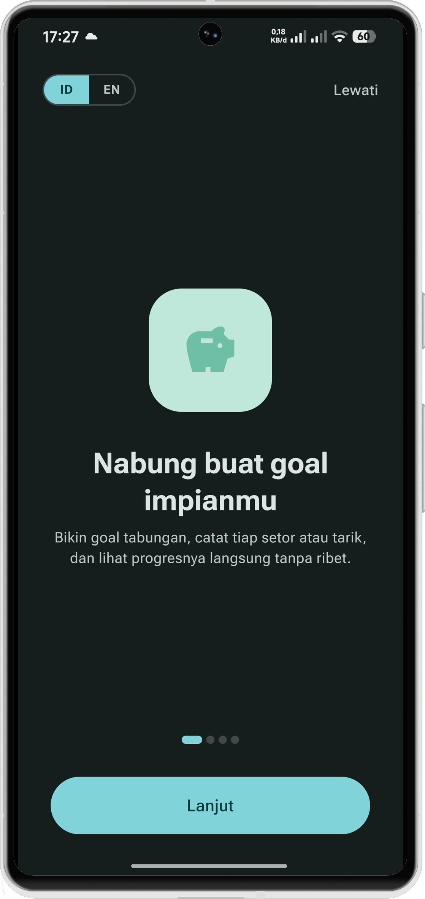
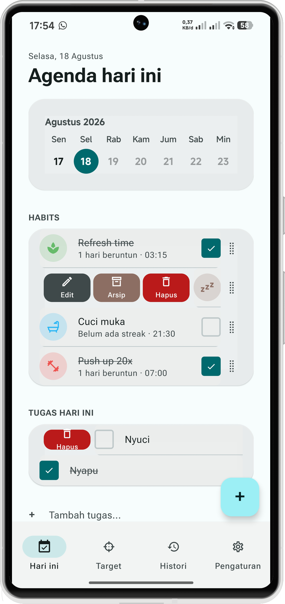
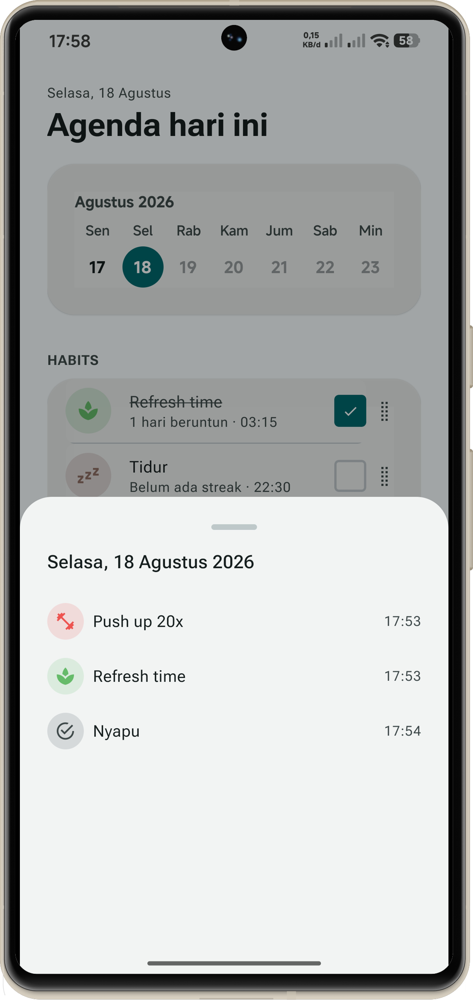
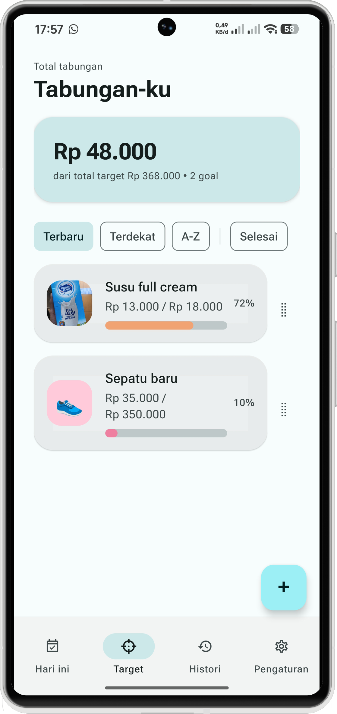
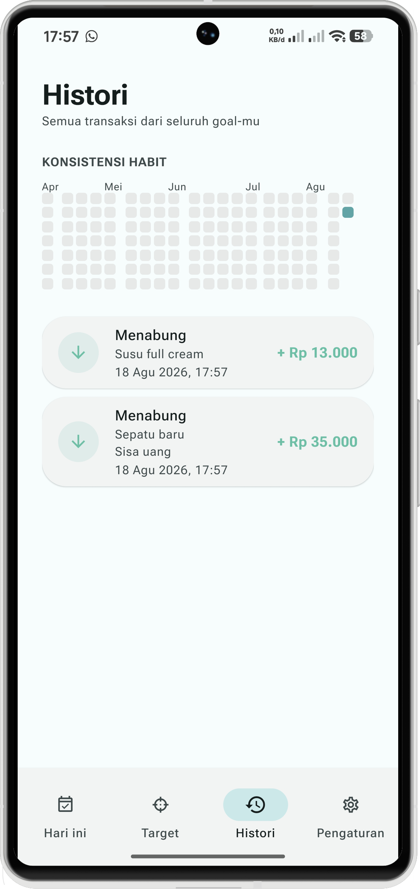
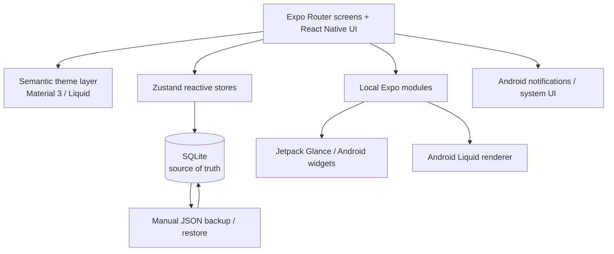

<p align="center">
  
</p>

<h1 align="center">Heibi</h1>

<p align="center">
  Habit tracker, tabungan, dan perencana harian dalam satu aplikasi Android yang personal, offline-first, dan dibuat untuk dipakai setiap hari.
</p>

<p align="center">
  <a href="../../releases"><strong>Download</strong></a>
  ·
  <a href="#why-heibi"><strong>Why Heibi?</strong></a>
  ·
  <a href="#fitur-utama"><strong>Fitur</strong></a>
  ·
  <a href="#architecture"><strong>Architecture</strong></a>
  ·
  <a href="#development"><strong>Development</strong></a>
</p>

<p align="center">
  
  
  
  
  
  
</p>

<p align="center">
  
  
  
  
  
</p>

## Why Heibi?

Banyak aplikasi produktivitas memisahkan habit, tugas, dan tabungan ke produk yang berbeda. Heibi mengambil arah sebaliknya: tiga hal kecil yang sering dicek setiap hari ditempatkan dalam satu aplikasi tanpa membuat alurnya terasa padat.

Heibi tidak membutuhkan akun untuk penggunaan utamanya, tidak bergantung pada koneksi internet, dan menjadikan SQLite lokal sebagai source of truth. Fokus project ini bukan menambah sebanyak mungkin fitur, tetapi membuat interaksi inti terasa cepat, jelas, dan tetap nyaman dipakai berulang kali.

| Prinsip | Implementasi di Heibi |
| --- | --- |
| **Local-first** | Data utama disimpan di SQLite pada perangkat. |
| **No account required** | Penggunaan utama tidak membutuhkan login atau cloud account. |
| **One daily surface** | Habit dan tugas hari ini bertemu di layar Today. |
| **Android-native where useful** | Home widget, notification behavior, dan optical material memakai native Android/local Expo modules bila memang dibutuhkan. |
| **Expressive, not noisy** | Material 3 Expressive dipakai untuk hierarchy, shape, motion, dan interaction state tanpa mengubah semua permukaan menjadi dekoratif. |
| **Accessible motion** | Reduced-motion path, touch target, state feedback, dan semantic accessibility tetap dipertahankan. |

## Fitur utama

### Habit tracking

- Habit harian maupun jadwal hari tertentu.
- Current streak dan best streak.
- Heatmap untuk melihat konsistensi dari waktu ke waktu.
- Reminder per habit.
- Swipe action untuk edit, arsip, dan hapus.
- Drag reorder dengan urutan yang dipersist ke SQLite.
- Home screen heatmap widget melalui local Android module.

### Goals & savings

- Banyak goal tabungan dengan target nominal, emoji, atau gambar.
- Deposit dan withdrawal dengan riwayat transaksi.
- Progress visual untuk setiap goal.
- Filter, sorting, dan drag reorder.
- Undo untuk penghapusan goal dalam jendela waktu terbatas.
- Home screen widget untuk melihat progres tanpa membuka aplikasi.

### Today

- Habit yang memang due hari ini.
- Tugas harian dalam layar yang sama.
- Quick completion dan interaction feedback.
- Drag & drop reorder.
- Celebration state ketika aktivitas hari itu selesai.

### History, backup, dan data

- Activity history yang dikelompokkan berdasarkan hari.
- SQLite sebagai source of truth dengan Zustand sebagai reactive in-memory cache.
- Migration incremental memakai `PRAGMA user_version`.
- Export/import backup JSON manual.
- Gambar goal ikut disertakan di backup agar bisa dipulihkan di perangkat lain.
- Backup restore melakukan validasi runtime sebelum mengganti data lokal.

### Personalization

- Bahasa Indonesia dan English.
- Light/dark mengikuti system color scheme Android.
- Material You dynamic color pada perangkat yang mendukung, dengan fallback palette Heibi.
- Pilihan visual theme Material 3 atau Liquid.
- Adaptive icon dan monochrome icon Android.
- Notification color handling melalui config plugin Android.

## Screenshot showcase

<table>
  <tr>
    <td align="center"></td>
    <td align="center"></td>
    <td align="center"></td>
  </tr>
  <tr>
    <td align="center"><strong>Onboarding</strong></td>
    <td align="center"><strong>Today / Habit</strong></td>
    <td align="center"><strong>Calendar</strong></td>
  </tr>
  <tr>
    <td align="center"></td>
    <td align="center"></td>
    <td align="center"><strong>More polish in progress</strong><br/>Heibi terus dikembangkan lewat checkpoint kecil dan tervalidasi.</td>
  </tr>
  <tr>
    <td align="center"><strong>Savings</strong></td>
    <td align="center"><strong>History</strong></td>
    <td align="center"><strong>Android-first</strong></td>
  </tr>
</table>

## Design direction

Heibi menggabungkan **Material 3 Expressive**, **Material You dynamic color**, dan contextual material treatment yang terinspirasi dari **Liquid Glass**. Liquid di sini bukan glassmorphism yang ditempel ke semua card; penggunaannya dibatasi pada chrome dan control tertentu ketika material tersebut memang membantu hierarchy atau interaction.

Material 3 menjadi fondasi utama untuk semantic color, typography, shape, motion, dan accessibility. Project juga memiliki shape original seperti `CookieShape` dan `WaveShape`, serta Roboto Flex untuk menjaga karakter typography tetap konsisten lintas perangkat.

Untuk Liquid navigation, Heibi memiliki renderer Android original dengan tier bertahap:

- **API 24–30** → tonal fallback.
- **API 31–32** → bounded backdrop capture + blur ketika renderer tersedia.
- **API 33+** → optical tier dapat memakai RuntimeShader untuk refraction ringan.
- **Low-RAM / failure path** → kembali ke tonal fallback, bukan memaksa efek mahal.

Renderer tidak menjalankan continuous idle redraw loop dan hanya diadopsi secara selektif untuk navigation/control yang memang membutuhkannya.

## Architecture



### Data flow

Core stores menggunakan pola **write-through**: operasi ditulis ke SQLite terlebih dahulu, kemudian state in-memory diperbarui. Dengan begitu UI tidak dianggap sukses sebelum persistence lokal selesai.

```text
User action
   ↓
React Native screen/component
   ↓
Zustand action
   ↓
SQLite transaction / query
   ↓
Update in-memory state
   ↓
Reactive UI refresh
```

## Tech stack

| Teknologi | Peran |
| --- | --- |
| Expo SDK 57 | Application framework dan native tooling |
| React Native 0.86 | Android UI runtime |
| Expo Router | File-based navigation |
| TypeScript | Type-safe application code |
| expo-sqlite | Local database / source of truth |
| Zustand | Reactive application state di atas SQLite |
| react-native-gesture-handler | Swipe dan gesture interactions |
| react-native-reanimated | Motion dan interaction animation |
| react-native-svg | Custom expressive shapes |
| @pchmn/expo-material3-theme | Material You dynamic colors |
| expo-notifications | Local reminders dan notification handling |
| @expo/ui | Native Android UI ketika dibutuhkan |
| Jetpack Glance | Android home screen widgets melalui local Expo module |
| Android RenderEffect / RuntimeShader | Blur dan bounded optical Liquid renderer pada API yang mendukung |
| Roboto Flex | Application typography |
| Jest | Unit dan behavior tests |
| GitHub Actions | Typecheck, lint, test, dan Android export validation |
| EAS Build | Development, preview, dan production Android builds |

## Project structure

```text
app/
├── _layout.tsx
├── onboarding.tsx
├── (tabs)/
│   ├── _layout.tsx
│   ├── index.tsx
│   ├── goals.tsx
│   ├── history.tsx
│   └── settings.tsx
├── goal/
└── habit/

src/
├── components/      # Shared UI, navigation, liquid, interaction components
├── db/              # SQLite client, schema, migrations
├── hooks/           # App hooks, reorder, reduced motion, translations
├── i18n/            # Indonesian + English strings
├── screens/         # Presentation helpers
├── store/           # Zustand stores / write-through data actions
├── theme/           # Semantic theme, Material 3, shapes, typography
├── types/
├── utils/           # Backup, notifications, dates, images, currency
└── widgets/         # JS-side widget data bridge

modules/
├── expo-home-widgets/   # Local Expo module + Android widgets / Jetpack Glance
└── expo-liquid-glass/   # Original bounded Android Liquid renderer

plugins/
├── withAndroidApkSize.js
└── withDynamicNotificationColor.js

.github/workflows/
└── ci.yml
```

## Quality & CI

Setiap push ke `main` dan pull request menuju `main` menjalankan workflow CI yang mencakup:

```text
npm ci
  ↓
npx tsc --noEmit
  ↓
npx eslint .
  ↓
npx jest
  ↓
npx expo export --platform android
```

CI membantu memastikan perubahan JavaScript/TypeScript tetap type-safe, lint-clean, lolos test, dan masih bisa diekspor untuk Android sebelum perubahan dianggap selesai.

## Development

### Requirements

- Node.js 22-compatible environment.
- npm.
- Expo / EAS CLI sesuai workflow yang digunakan.
- Android device atau development environment yang kompatibel.

Clone repository dan install dependency:

```bash
git clone https://github.com/karimm1620/heibi.git
cd heibi
npm install
```

Untuk dependency Expo / React Native baru, gunakan Expo installer agar versi tetap sesuai dengan SDK:

```bash
npx expo install <package-name>
```

Setelah mengubah dependency atau native configuration:

```bash
npx expo-doctor
```

Jalankan Metro:

```bash
npx expo start
```

Quality checks lokal:

```bash
npx tsc --noEmit
npx eslint .
npx jest
npx expo export --platform android
```

### EAS Build

```bash
eas build --profile development --platform android
eas build --profile preview --platform android
eas build --profile production --platform android
```

`development` dan `preview` menggunakan internal distribution. Profile `production` menggunakan auto-increment versioning.

## Download

Build publik tersedia melalui **[GitHub Releases](../../releases)**.

Heibi belum menggunakan Google Play sebagai jalur distribusi utama. Android dapat menampilkan peringatan ketika APK dipasang dari luar Play Store, jadi pastikan file berasal dari release repository ini.

## Privacy

Heibi dirancang offline-first. Penggunaan utama tidak membutuhkan login atau cloud account, dan data aplikasi disimpan lokal pada perangkat. Backup dilakukan manual oleh pengguna melalui file yang dapat diekspor dan dipulihkan kembali.

## Contributing

Issue dan pull request terbuka untuk bug report, improvement, maupun perubahan yang tetap sejalan dengan arah project.

Untuk perubahan besar, buka issue atau discussion context terlebih dahulu agar implementasi tidak bertabrakan dengan keputusan desain, persistence, native Android, atau compatibility yang sedang dipakai.

Sebelum membuka PR, jalankan minimal:

```bash
npx tsc --noEmit
npx eslint .
npx jest
npx expo export --platform android
```

## Support

Kalau Heibi bermanfaat dan kamu ingin mendukung pengembangannya, kamu bisa traktir kopi lewat **[Saweria](https://saweria.co/immu)**.

## License

Heibi tersedia di bawah [MIT License](./LICENSE).

Copyright © 2026 Abdul Karim Sulaeman.
